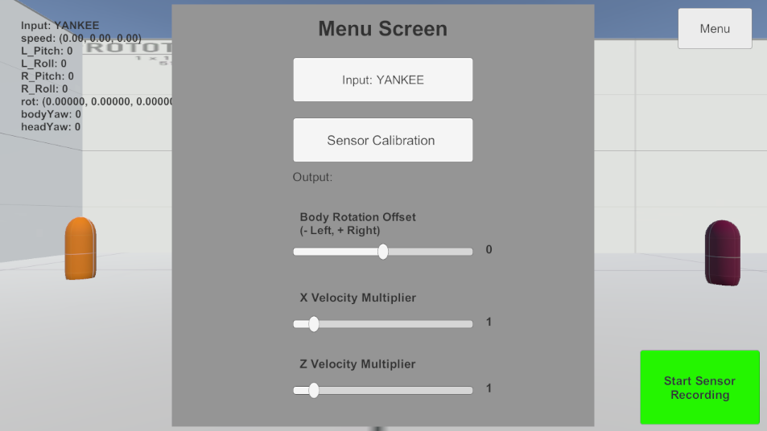

# vr-kat-project-game-research
# KATNN: KAT Walk C: Motion Capture and Machine Learning to Predict Human Motion

## Description

This project focuses on utilizing Machine Learning and Neural Networks in order to make predictions on the trajectory of the virtual character based on Motion Capture Data collected from the accompanied research project Virtual Reality Game unity game. This part of the project will focus on creating a game which has the ability to bidirectionally communicate with our python scripts via. WebSockets, having the ability to record sensor data and export it to csv for it to be used for training purposes, and have our game connect to a Virtual Reality Headset to immurse the user into the Virtural environment. 

<figure>
  
  <figcaption>Figure 1: This figure starts from the Unity Game, which then collects sensor data, this data is then sent to this server to make trajectory predictions which is then communicated back to our unity game.</figcaption>
</figure>

## Installation & Testing Purposes

For development purposes, the Meta Quest 2 Virtual Reality was used which was connected to the desktop used via Airlink through the Oculus Rift Software. For more information on how to setup the Meta Quest 2 to be used alongside a desktop, see the following link: https://www.meta.com/help/quest/articles/headsets-and-accessories/oculus-link/connect-with-air-link/

Other softwares included is Visual Studio, on the desktops used for development the following were added during the installation:
- .NET desktop development (NECESSARY)
- Game development with Unity (NECESSARY)
- Python development (OPTIONAL)

Other devices you will need include:
- KAT Walk C

# Running the game with Neural Network

The following steps are necessary to run the game with the Neural Network annd new Trajectory logic:
1. Install the research python related code which can be found here: https://github.com/JKen0/vr-kat-project-python
2. When the research python code is installed, run the Websocket server script to run the local python server which is on port 3003 (make sure no application is occupying port 3003)
3. When server is running, locate "./game-files/" and run test-kat-project application. This will launch the game. Game should be loaded on your desktop.
4. On your game application, on the top right you should see a button on the top right which says "MENU" to open the menu. Then click on the "INPUT: SDK" button, click the button so it says "INPUT: NEURALNET". This will change the input system from the SDK implementation to our Neural Network implementation. 
5. Turn on Meta Quest 2, and connect Meta Quest 2 to your desktop via Airlink/CableLink.
6. When connected, launch to the desktop and on thhe taskbar should be a unity icon which will bring you to launch the game on your Meta Quest.
7. Done, you should see the game environment in the lens of your Meta Quest 2. 

# Game Functionalities 

The game has many functionalities including the following: 

1. Sensor Recording Button (Bottom Right): This button enables the ability to collect sensor readings and export them to a CSV to bbe used for analysis. 
2. Changing Input System (Menu/Input Button): This button allows the user to change the input system from the SDK implementation to our KATNN algorithm or vice versa. 
3. Sensor Calibration Button (Menu/Calibration Button): This will calibrate the user by lining up the body rotation and headet rotation in order to adjust the users rotation to properly move forward. 
4. Sensor Offset Slider (Menu/Calibration Slider): In the event sensor calibration results in drifting, the user can use this slider in order to offset the drift the user experiencing. If user drifts to the left, move slider to right, and vice versa. 
5. Velocity Multiplier (Menu/X or Z Multiplier Slider): These two sliders allow the user to adjust the movement to become more faster or slower, depending on their preference. 
    - X Multiplier will adjust the velocity going left to righht
    - Z Multiplier will adjust the velocity going forward and back

<figure>
  
  <figcaption>Figure 2: This figure shows the menu screen of our game and the multiple buttons/sliders that the user can interact with in order to get the more realistic immersion when moving around.</figcaption>
</figure>

